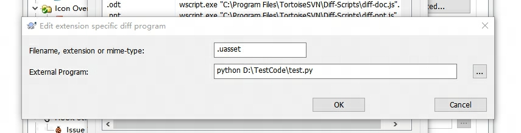

# SVNTortoiseUassetDiff
a UE uasset diff tool  
install python3  
TortoiseSVN->Settings->Diff Viewer->Advance->Add  
  
External Programe Should be write like this:  
python G:\SVNTortoiseUassetDiff\UAssetDiff.py  "C:\Program Files\TortoiseSVN\Diff-Scripts\diff-sxw.vbs" %base %mine //E:vbscript  
the "G:\SVNTortoiseUassetDiff\UAssetDiff.py" should change to the path Point to the UAssetDiff.py file of this repository  